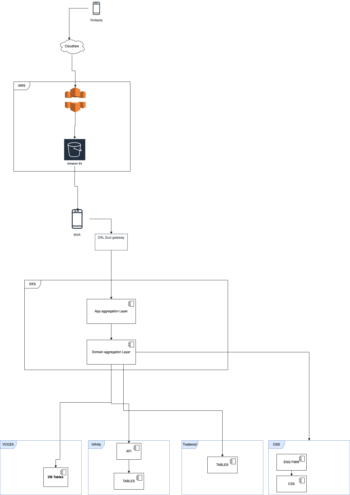

# [Project] Software Architecture

We plan to build the application using [Architecture] style. 

## Architecture Diagram

> We recommend building architecture using [Draw.io](https://app.diagrams.net/). Draw.io also has a desktop application.

## Technologies

The list of technologies we will use to build the application are as follows:

| Technology              | Purpose                                               | Version    |
| ----------------------- | ----------------------------------------------------- | ---------- |
| **React**               | Frontend framework for building user interfaces     | 17.0.1     |
| **TypeScript**          | Superset of JavaScript that adds static types        | 5.1.3      |
| **Yarn**                | Package manager for managing dependencies            | 1.22.19    |
| **Turborepo**           | Monorepo tool for managing multiple packages         | 1.10.12    |
| **Vite**                | Build tool and development server                    | 4.1.2      
| **Styled-components**   | Library for styling React components                 | 5.3.6      |
| **Prettier**            | Code formatter for consistent style                  | Latest     |
| **ESLint**              | Linter for identifying and fixing problems in code   | 8.47.0     |
| **Husky**               | Git hooks for automating tasks                        | 4.3.8      |
| **Lint-staged**         | Run linters on pre-committed files                    | 13.2.0     |
| **Source-map-explorer** | Tool for analyzing and visualizing source maps        | 2.5.3      |
| **Bun**                 | JavaScript runtime for faster builds and execution   | -          |
| **Turbo**               | High-performance build system and task runner        | 1.10.12    |
| **@tanstack/react-query-devtools** | Devtools for React Query to inspect and debug queries | 5.51.11   |

## Non-functional Requirements

Non-functional requirement for the project are:

| Quality Attribute | Description                                                  | Target                                                       |
| ----------------- | ------------------------------------------------------------ | ------------------------------------------------------------ |
| [Performance]     | [Transaction Response Time]                                  | [2 seconds]                                                  |
| [Availability]    | [System Uptime]                                              | [99.9]                                                       |
| [Throughput]      | [Number of requests/transactions per second at peak time]    | [1000 RPS]                                                   |
| [Auditability]    | [Ability of the application to show what has happened to it, who did it and when] | [A log file that captures the event with the timestamp]      |
| [Reliability]     | [Mean time to recovery]                                      | [System should be able to recover from failure under 5 mins] |
| [Usability]       | [Usability can be described as the capacity of a system to provide a condition for its users to perform the tasks safely, effectively, and efficiently while enjoying the experience] | [Browsers: Chrome, IE, Firefox]  [Screen Size]          |

